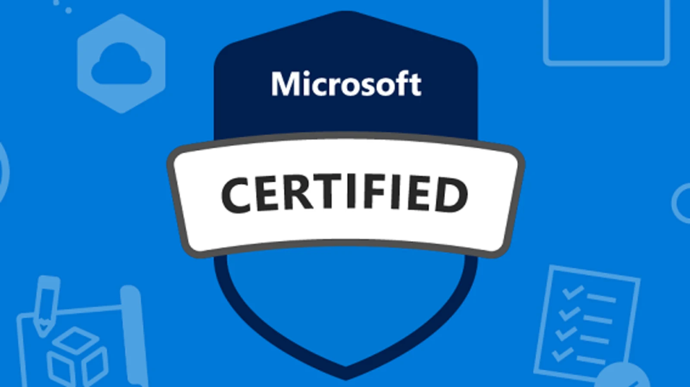

# Microsoft Data Scientist
Learn new skills and discover the power of Microsoft products with step-by-step guidance. Start my journey  by exploring the learning paths and modules to prepare for microsoft certification exam.

   

  

**Background in:** Mathematics, Python, Machine Learning and Applied Math.

**Links:**
* [LinkedIn](https://www.linkedin.com/in/joão-pedro-lavor-65162312b/)
* [Medium](https://jplavorr.medium.com/)

## Projects (Week 1):

* **Examine real world data:** https://bit.ly/3OlP38W
* **Train and evaluate a regression model:** https://bit.ly/3a0uboY
* **Experiment with more powerful regression models:** https://bit.ly/3QW4SFg
* **Optimize and save models:** https://bit.ly/3NqyMhF

---

## Projects (Week 2):
* **Train and evaluate a classification model:** https://bit.ly/3PjSMEo
* **Perform classification with alternative metrics:** https://bit.ly/3aNpPSg
* **Train and evaluate multiclass classification models:** https://bit.ly/3zd3Iht
* **Train and evaluate a clustering model:** https://bit.ly/3Og9Cmk
* **Train and evaluate advanced clustering models:** https://bit.ly/3cm4MGW

